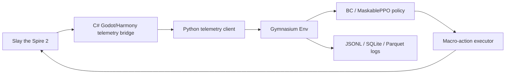

# Architecture

## Status

This is the target architecture for the rewrite and the current fixture-based Python implementation. The current checkout contains `src/`, `tests/`, `bridge/`, `config/`, and telemetry fixtures, but it does not yet contain live Godot/Harmony attach or production named-pipe transport.

## Goal

The target architecture is a telemetry-driven ML automation research stack for Slay the Spire 2. The canonical runtime flow is:

```text
Game -> C# telemetry bridge -> Python Gymnasium env/ML -> macro-action executor
```

The old TAS movie/replay/checkpoint and OCR-first direction is retired. New docs, tests, and CLI contracts should describe telemetry snapshots, valid action masks, Gymnasium steps, and macro actions.

## Runtime Flow



The bridge is the target authority for structured game state. OCR-first runtime paths should not be expanded.

## Current Gap

The following surfaces are present as fixture/local implementations:

- `bridge/Sts2TelemetryBridge`
- `config/patch-points.0.1-test.json`
- `src/sts2_tas/telemetry_schema.py`
- `src/sts2_tas/telemetry_client.py`
- `src/sts2_tas/env.py`
- `src/sts2_tas/action_space.py`
- `src/sts2_tas/executor.py`
- `src/sts2_tas/heuristic.py`
- `src/sts2_tas/bc.py`
- `src/sts2_tas/rl.py`
- `src/sts2_tas/dataset.py`
- telemetry fixtures under `data/fixtures/`

Remaining live-game gaps are Harmony patch bootstrap, production named-pipe/WebSocket transport, actual game frame emission, and Windows `--execute` acknowledgement against the target process.

## Bridge Project

The target bridge is `bridge/Sts2TelemetryBridge`, a Godot 4 C#/.NET project. Its `.sln` and `.csproj` files should be version-controlled so the bridge build shape is explicit. Harmony patch bootstrap should read `config/patch-points.<game_version>.json`; if inspected symbols do not match the running game version, the bridge must emit fail-closed diagnostics instead of guessing.

The default transport is a Windows named pipe. WebSocket is optional for tooling. The bridge should emit `TelemetrySnapshot` frames and accept `MacroActionCommand` envelopes from Python only after schema and target validation.

## TelemetrySnapshot

A `TelemetrySnapshot` is the target Python bridge input. It must include:

- `game_version`, `mod_version`, `schema_version`, `seed`, `timestamp`
- `phase`: `combat`, `card_reward`, `map`, `shop`, `event`, `rest`, `terminal`, or `menu`
- `floor`, `act`, `screen_id`
- `player`: hp, max hp, energy, block, gold, powers, resources
- `hand`, `draw_pile`, `discard_pile`, `exhaust_pile`
- `enemies` with ids, slots, hp, block, intent, powers
- `relics`, `potions`, map choices, reward choices, shop choices, event/rest choices
- `valid_actions`: canonical macro actions available in the current phase

Unknown or patch-sensitive fields belong in `extras` with the source `game_version`. Required fields must fail validation instead of being silently guessed.

## Valid Action Mask

The target Python action space owns deterministic flattening. Every `ValidAction` gets a stable id derived from action type and arguments. `action_space.py` maps between:

- structured `MacroAction`
- flattened `Discrete(N)` index
- boolean valid action mask
- executor command payload

The model may only select legal actions. All-false masks, duplicate action identities, malformed arguments, and stale masks are hard failures.

## MacroAction

The policy chooses macro actions, not coordinates.

Supported initial action types:

- `play_card(hand_slot, target_slot?)`
- `end_turn`
- `choose_reward(choice_slot)`
- `choose_map_node(node_slot)`
- `choose_event_option(choice_slot)`
- `shop_buy(item_slot)`
- `shop_remove(card_slot)`

The executor converts macro actions to guarded input sequences using current target window metadata. Coordinates are window-relative. Native input requires `--execute`; dry-run writes the planned input to logs.

## Logging

Every target environment transition writes audit-ready records:

- `run_id`, `game_version`, `mod_version`, `seed`, `timestamp`
- `floor`, `phase`, `state_json`
- `valid_actions_json`, `chosen_action_json`
- `reward`, `terminal`, `result`
- optional `screenshot_path`, `policy_id`, `latency_ms`, `failure_reason`

JSONL is the default append-only format. SQLite and Parquet are planned once schemas stabilize.

## Safety Boundary

Allowed:

- single-player local research
- structured state export through a local bridge
- dry-run action planning
- explicitly gated local OS input
- offline training and evaluation

Forbidden:

- online co-op automation
- Steam Leaderboards automation
- memory writes or result mutation
- anti-cheat bypass design
- public-match automation
- network side effects from the bridge

If target process, bridge schema, versioned patch points, or action acknowledgement do not match expectations, the runtime must fail closed and log diagnostics.
