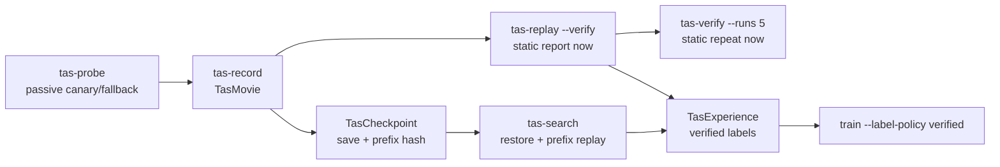

# Architecture

## Goal

v1 목표는 Windows interactive desktop에서 실제 Slay the Spire 2를 대상으로 같은 movie를 재생했을 때 drift 없이 같은 결과에 도달하는 TAS runtime을 만드는 것이다. 현재 repo는 이 목표를 위한 artifact/schema/static verifier 경계까지 구현되어 있고, live Windows replay backend는 gap으로 남아 있다.

v1의 결정성 기준:

1. semantic movie 기록
2. deterministic physical input replay
3. cold checkpoint restore
4. 5회 replay verification

mid-frame memory savestate, simulation tick freeze, RNG/time hook은 v1 완료 기준이 아니다.

## Runtime Flow

## Data Contracts

`TasMovie` is the replay artifact. It stores ordered `TasFrame` rows with:

- `semantic_action`
- `physical_input`
- `screen_hash`
- `state_fingerprint`
- `decision_context`
- `source_policy`
- `label_source`
- `outcome_ref`

`TasCheckpoint` is a cold checkpoint artifact. It stores:

- explicit save file path and SHA-256
- movie prefix length and prefix hash
- screen hash and state fingerprint expected after restore + prefix replay

`TasExperience` is the ML provenance artifact. It keeps the selected action, legal actions, policy source, label source, movie frame, state fingerprint, transition ack, terminal return, and failure/no-op/drift markers.

## Input Model

Semantic actions are stored as game-level choices. Physical inputs are produced only for replay/execution.

- `play_card` in combat maps hand slot to `DigitN`.
- targeted attack cards map to `DigitN -> monster click`.
- non-targeted cards map to `DigitN`.
- `end_turn` maps to `E`.
- map, event, reward skip, proceed, and other non-verified shortcuts stay coordinate click based.

Combat classification must beat card reward classification so the card reward parser cannot steal combat card text.

## Windows Hook Boundary

`native/sts2_tas_hook/` is a passive-only x64 Windows canary scaffold.

Allowed:

- Detours-based future `IDXGISwapChain::Present` observation
- frame counter
- foreground/window metadata
- optional screenshot/frame hash evidence

Forbidden in v1 canary:

- input hook
- time hook
- focus stealing
- memory mutation
- RNG/tick patching
- network side effects

If hook attach fails, Python live/fallback paths may still emit diagnostics, but those rows are `tas_grade=false` and cannot satisfy TAS acceptance.

## ML Gate

Default supervised `TasExperience` rows require:

- `label_source` is `human`, `search_success`, or `verified_heuristic`
- `changed_ack=true`
- selected action is legal and present in legal actions
- `terminal_return is not None`
- no failure reason
- no no-op marker
- no drift marker

`model_self`, failed rollout, no-op, drift, illegal, and no-terminal rows are retained only for evaluation or negative analysis.

## Target Acceptance Gates

현재 코드가 모두 만족한다는 뜻이 아니라, v1 TAS-grade로 인정하기 위한 목표 Gate다. static verifier와 Python fallback output은 Gate 5 acceptance evidence가 아니다.

- Gate 0: `tas-probe` attaches or records passive fallback with explicit `tas_grade=false`.
- Gate 1: short movie replay has no screen/state fingerprint drift.
- Gate 2: combat input uses numeric card selection, target click, non-target card keypress, and `E`.
- Gate 3: checkpoint restore + prefix replay reaches the same decision fingerprint.
- Gate 4: trainable TAS experience rows pass the verified label gate.
- Gate 5: live Windows `tas-verify --runs 5` reports five victories, zero drift, zero unclassified screen, zero target-window mismatch.
