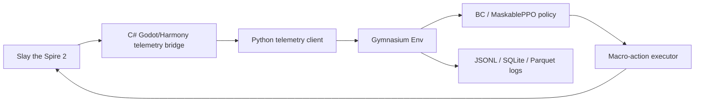

# Architecture

## Goal

The target architecture is a telemetry-driven ML automation research stack for Slay the Spire 2. The canonical runtime flow is:

```text
Game -> C# telemetry bridge -> Python Gymnasium env/ML -> macro-action executor
```

The old TAS movie/replay/checkpoint and native canary direction is retired. Remove those public surfaces as the rewrite proceeds. Historical artifacts may stay in git history, but new docs, tests, and CLI contracts should describe telemetry snapshots, valid action masks, Gymnasium steps, and macro actions.

## Runtime Flow



The bridge is the authority for structured game state. OCR-first runtime paths are retired public surfaces and should be removed as the rewrite proceeds.

## Bridge Project

`bridge/Sts2TelemetryBridge` is a Godot 4 C#/.NET project. The `.sln` and `.csproj` files are version-controlled so the bridge build shape is explicit. Harmony patch bootstrap reads `config/patch-points.<game_version>.json`; if inspected symbols do not match the running game version, the bridge emits fail-closed diagnostics instead of guessing.

The default transport is a Windows named pipe. WebSocket is an optional transport for tooling. The bridge emits `TelemetrySnapshot` frames and accepts `MacroActionCommand` envelopes from Python only after schema and target validation.

## TelemetrySnapshot

A `TelemetrySnapshot` is the Python bridge input. It must include:

- `game_version`, `mod_version`, `schema_version`, `seed`, `timestamp`
- `phase`: `combat`, `card_reward`, `map`, `shop`, `event`, `rest`, `terminal`, or `menu`
- `floor`, `act`, `screen_id`
- `player`: hp, max hp, energy, block, gold, powers, resources
- `hand`, `draw_pile`, `discard_pile`, `exhaust_pile`
- `enemies` with ids, slots, hp, block, intent, powers
- `relics`, `potions`, map choices, reward choices, shop choices, event/rest choices
- `valid_actions`: canonical macro actions available in the current phase

Unknown or patch-sensitive fields belong in `extras` with the source `game_version`. Required fields must fail validation instead of being silently guessed.

## Valid Action Mask

The Python action space owns deterministic flattening. Every `ValidAction` gets a stable id derived from action type and arguments. `action_space.py` maps between:

- structured `MacroAction`
- flattened `Discrete(N)` index
- boolean valid action mask
- executor command payload

The model may only select legal actions. All-false masks, duplicate action identities, malformed arguments, and stale masks are hard failures.

## MacroAction

The policy chooses macro actions, not coordinates.

Supported initial action types:

- `play_card(hand_slot, target_slot?)`
- `end_turn`
- `choose_reward(choice_slot)`
- `choose_map_node(node_slot)`
- `choose_event_option(choice_slot)`
- `shop_buy(item_slot)`
- `shop_remove(card_slot)`

The executor converts macro actions to guarded input sequences using current target window metadata. Coordinates are window-relative. Native input requires `--execute`; dry-run writes the planned input to logs.

## Logging

Every environment transition writes audit-ready records:

- `run_id`, `game_version`, `mod_version`, `seed`, `timestamp`
- `floor`, `phase`, `state_json`
- `valid_actions_json`, `chosen_action_json`
- `reward`, `terminal`, `result`
- optional `screenshot_path`, `policy_id`, `latency_ms`, `failure_reason`

JSONL is the default append-only format. SQLite and Parquet are planned once schemas stabilize.

## Safety Boundary

Allowed:

- single-player local research
- structured state export through a local bridge
- dry-run action planning
- explicitly gated local OS input
- offline training and evaluation

Forbidden:

- online co-op automation
- Steam Leaderboards automation
- memory writes or result mutation
- anti-cheat bypass design
- public-match automation
- network side effects from the bridge

If target process, bridge schema, versioned patch points, or action acknowledgement do not match expectations, the runtime must fail closed and log diagnostics.
