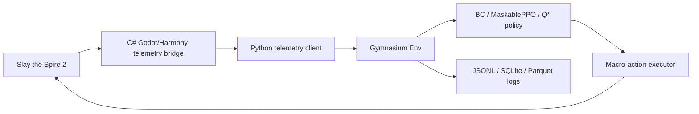

# Architecture

## Status

This is the target architecture for the rewrite. The checkout now includes a Harmony telemetry mod, named-pipe/TCP transport, and a Q* live play loop. Live attach still fail-closes when the running game version or patch-point symbols do not match `config/patch-points.<game_version>.json`.

## Goal

The target architecture is a telemetry-driven ML automation research stack for Slay the Spire 2. The canonical runtime flow is:

```text
Game -> C# telemetry bridge -> Python Gymnasium env/ML -> macro-action executor
```

The old TAS movie/replay/checkpoint and OCR-first direction is retired. New docs, tests, and CLI contracts should describe telemetry snapshots, valid action masks, Gymnasium steps, and macro actions.

## Runtime Flow


```mermaid
flowchart LR
    Game["Slay the Spire 2"]
    Bridge["C# Godot/Harmony telemetry bridge"]
    Client["Python telemetry client"]
    Env["Gymnasium Env"]
    Policy["BC / MaskablePPO / Q* policy"]
    Executor["Macro-action executor"]
    Logs["JSONL / SQLite / Parquet logs"]

    Game --> Bridge
    Bridge --> Client
    Client --> Env
    Env --> Policy
    Policy --> Executor
    Executor --> Game
    Env --> Logs
```

The bridge is the target authority for structured game state. OCR-first runtime paths should not be expanded.

## Current Gap

The following surfaces are present as fixture/local implementations:

- `bridge/Sts2TelemetryBridge`
- `config/patch-points.0.1-test.json`
- `src/sts2_tas/telemetry_schema.py`
- `src/sts2_tas/telemetry_client.py`
- `src/sts2_tas/env.py`
- `src/sts2_tas/action_space.py`
- `src/sts2_tas/executor.py`
- `src/sts2_tas/heuristic.py`
- `src/sts2_tas/bc.py`
- `src/sts2_tas/rl.py`
- `src/sts2_tas/qstar.py`
- `src/sts2_tas/dataset.py`
- telemetry fixtures under `data/fixtures/`

The Harmony mod `bridge/Sts2TasMod` loads through the official `[ModInitializer]`, patches `CombatStateTracker.NotifyCombatStateChanged`, emits `TelemetrySnapshot` frames on pipe `sts2-tas`, and applies `play_card` / `end_turn` through `PlayCardAction` and `PlayerCmd.EndTurn`. `run-live` consumes those frames, chooses with Q*, and updates weights from real HP deltas. Fixture TCP `pipe-serve` is the Windows smoke path when the game window is not in combat.

## Bridge Project

The target bridge is `bridge/Sts2TelemetryBridge`, a Godot 4 C#/.NET project. Its `.sln` and `.csproj` files should be version-controlled so the bridge build shape is explicit. Harmony patch bootstrap should read `config/patch-points.<game_version>.json`; if inspected symbols do not match the running game version, the bridge must emit fail-closed diagnostics instead of guessing.

The default transport is a Windows named pipe. WebSocket is optional for tooling. The bridge should emit `TelemetrySnapshot` frames and accept `MacroActionCommand` envelopes from Python only after schema and target validation.

## TelemetrySnapshot

A `TelemetrySnapshot` is the target Python bridge input. It must include:

- `game_version`, `mod_version`, `schema_version`, `seed`, `timestamp`
- `phase`: `combat`, `card_reward`, `map`, `shop`, `event`, `rest`, `terminal`, or `menu`
- `floor`, `act`, `screen_id`
- `player`: hp, max hp, energy, block, gold, powers, resources
- `hand`, `draw_pile`, `discard_pile`, `exhaust_pile`
- `enemies` with ids, slots, hp, block, intent, powers
- `relics`, `potions`, map choices, reward choices, shop choices, event/rest choices
- `valid_actions`: canonical macro actions available in the current phase

Unknown or patch-sensitive fields belong in `extras` with the source `game_version`. Required fields must fail validation instead of being silently guessed. The current parser accepts only schema version `1`, rejects boolean integer fields, rejects stale non-empty actions on `terminal` and `menu` snapshots, and validates advertised action slots against the snapshot's hand, enemies, and available choice lists before building an action mask.

## Valid Action Mask

The target Python action space owns deterministic flattening. Every `ValidAction` gets a stable id derived from action type and arguments. `action_space.py` maps between:

- structured `MacroAction`
- flattened `Discrete(N)` index
- boolean valid action mask
- executor command payload

The model may only select legal actions. All-false masks, duplicate action identities, malformed arguments, stale masks, unsupported schema versions, and out-of-range action slots are hard failures.

## MacroAction

The policy chooses macro actions, not coordinates.

Supported initial action types:

- `play_card(hand_slot, target_slot?)`
- `end_turn`
- `choose_reward(choice_slot)`
- `choose_map_node(node_slot)`
- `choose_event_option(choice_slot)`
- `shop_buy(item_slot)`
- `shop_remove(card_slot)`

The executor converts macro actions to guarded input sequences using current target window metadata. Coordinates are window-relative. Native input requires `--execute`; dry-run writes the planned input to logs.

## Q* Play Loop

`run-qstar` plays a snapshot until the environment is terminal or `max_steps` is hit. Each step:

1. Expand legal macros with limited-depth search. Immediate env reward is `g`; the learned linear Q-function is the heuristic `h`.
2. Convert the chosen macro to an executor plan, or native input when `--execute` is set.
3. Apply the action, write a JSONL transition, and take a TD update `Q(s,a) <- r + γ max_a' Q(s',a')`.
4. Persist weights after every episode so later runs continue from the updated model.

`run-qstar` remains the fixture/env trainer. `run-live` is the Harmony/pipe loop. Combat env still discards played cards, rebuilds energy-gated valid actions, and redraws on `end_turn` so Q* search has a local model.

## Logging

Every target environment transition writes audit-ready records:

- `run_id`, `game_version`, `mod_version`, `seed`, `timestamp`
- `floor`, `phase`, `state_json`
- `valid_actions_json`, `chosen_action_json`
- `reward`, `terminal`, `result`
- optional `screenshot_path`, `policy_id`, `latency_ms`, `failure_reason`

JSONL is the default append-only format. Records keep the audit fields and also expose `state`, `valid_actions`, and `chosen_action` aliases so collected demonstrations can be fed directly into behavioral cloning. SQLite and Parquet are planned once schemas stabilize.

## Safety Boundary

Allowed:

- single-player local research
- structured state export through a local bridge
- dry-run action planning
- explicitly gated local OS input
- offline training and evaluation

Forbidden:

- online co-op automation
- Steam Leaderboards automation
- memory writes or result mutation
- anti-cheat bypass design
- public-match automation
- network side effects from the bridge

If target process, bridge schema, versioned patch points, or action acknowledgement do not match expectations, the runtime must fail closed and log diagnostics.
